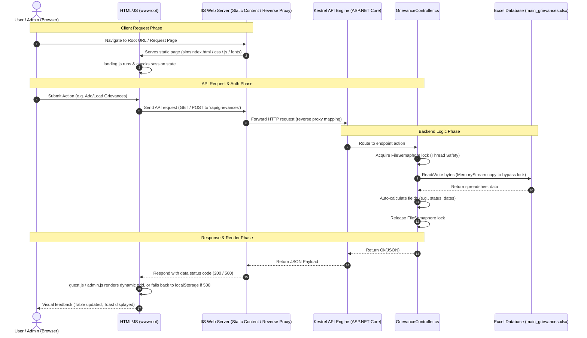

# Voice of People - Integrated Grievance Resolution System (IGRS)

A modern, offline-resilient, corporate-grade **Integrated Grievance Resolution System** built with **ASP.NET Core 8.0 Web API** and a **Vanilla HTML5/CSS3/JavaScript frontend**. 

This application is designed specifically for restricted intranet environments (where internet access is unavailable) and uses a **headless Excel-based database engine (EPPlus)** to store, read, and write grievance data without requiring an external database server (like SQL Server).

---

##  1. GitHub Security & Repository Sharing Guidelines

### 1.1 Public vs. Private Repository Policies
Because this application is deployed as a live hosted server project within a corporate network, **the source code should NOT be shared in a public GitHub repository**. It must be kept in a **Restricted/Private Repository** due to the following security risks:

* **Hardcoded Credentials:** The system contains local validation passwords (e.g., `"HR@NLCTPS2www"`) and internal server directory structures. If exposed publicly, malicious actors could access admin panels or exploit local directories.
* **Sensitive Business Data:** The database consists of an Excel spreadsheet (`main_grievances.xlsx`) containing real names, employee numbers, and private grievance details. Public exposure violates data protection laws and corporate privacy policies.
* **Security Vector Mapping:** Public repositories make it easy for attackers to map the API endpoints, endpoint schemas, and CORS configurations to launch targeted script injections or denial-of-service attempts.

### 1.2 Best Practices for Restricting Access
To maintain top-tier repository hygiene and security:
1. **Always set the repository visibility to Private** on GitHub.
2. **Utilize a `.gitignore` file** to ensure development database files, logs, and compiled assets are never tracked. Add the following rules to your `.gitignore`:
   ```git
   # Exclude Excel Database files
   /data/*.xlsx
   /data/old_data/*.xlsx
   
   # Exclude build output files
   /bin/
   /obj/
   
   # Exclude configuration values containing secrets
   appsettings.json
   appsettings.Development.json
   ```
3. **Environment-Specific Secrets:** For higher environments, move hardcoded passwords out of javascript/source code and utilize environment variables or secure vault storage.

---

##  2. Repository Structure & Internal Folder Tree

To maintain a presentable and clean structure, the directory hierarchy is organized as follows:

```text
Voice_of_People_IGRS/
├── Controllers/
│   └── GrievanceController.cs      # REST API endpoints (load, submit, archive)
├── Models/
│   └── Grievance.cs                # C# class mapping the database schema
├── Properties/
│   └── launchSettings.json         # Development server profiles
├── wwwroot/                        # Static Web Assets (Frontend)
│   ├── css/
│   │   └── style.css               # Modern glassmorphism stylesheet
│   ├── fonts/
│   │   ├── inter/                  # Localized font files (.woff2)
│   │   └── fonts.css               # Font-face declarations
│   ├── js/
│   │   ├── admin.js                # Admin panel logic & CRUD calls
│   │   ├── guest.js                # Guest portal submission logic
│   │   └── landing.js              # Welcome landing page router
│   ├── lib/
│   │   ├── xlsx.min.js             # SheetJS for browser-side fallback
│   │   └── jspdf.umd.min.js        # jsPDF for reports
│   ├── admin_dashboard.html        # Admin Dashboard View
│   ├── guest_dashboard.html        # Guest Submission Portal View
│   └── slmsindex.html              # Core Welcome Page (Renamed for master-page integration)
├── data/
│   ├── main_grievances.xlsx        # Main Excel Spreadsheet Database
│   └── old_data/                   # Backup directory for archives
├── web.config                      # IIS module mapping & MIME-types definition
├── appsettings.json                # API configuration parameters
├── Voice_of_People_IGRS.csproj     # MSBuild C# Project settings
└── Program.cs                      # Application Entry Point & middleware pipeline
```

---

##  3. System Workflow & Trigger Sequence Diagram

Below is the execution flow detailing which files trigger sequentially when a user accesses the hosted application:



---

##  4. Project Technical Specifications

### 4.1 Tech Stack Used
* **Frontend Core:** Vanilla HTML5, CSS3 CSS Variables (vibrant glassmorphism, responsive grid), Vanilla ES6 JavaScript (No bloated frameworks like React/Angular).
* **Frontend Libraries:** 
  * **SheetJS (xlsx.min.js):** Reads/writes Excel arrays locally in fallback mode.
  * **jsPDF & jsPDF-AutoTable:** Generates print-ready PDF reports on-the-fly.
* **Backend Core:** C# (.NET 8.0 Core), ASP.NET Core Web API.
* **Backend Libraries:** 
  * **EPPlus 8:** Professional headless Excel manipulation engine.
* **Hosting & Web Servers:** IIS (Internet Information Services) 10+ with ASP.NET Core Hosting Bundle.

### 4.2 Reasons for Stack Selection
* **Zero Infrastructure Footprint:** Deploying database engines like SQL Server or Oracle requires licensing fees, DBAs, and configuration. Using EPPlus headless Excel database keeps hosting costs at zero.
* **Corporate Intranet Compatibility:** Using pure Vanilla JS ensures the web pages run efficiently even on older legacy browsers inside locked-down corporate environments without downloading external framework nodes.
* **Business Transparency:** Storing records in `main_grievances.xlsx` allows corporate managers to open the file directly in Microsoft Excel to run custom pivot tables and charts without writing SQL queries.

### 4.3 Key Problems Resolved
* **Excel Access Collisions (Write Gating):** If a user opened the Excel spreadsheet directly on the server, the application crashed when writing. Resolved by creating a C# `SemaphoreSlim(1, 1)` gate and wrapping operations in a shared `MemoryStream` byte-copy read to make the system lock-proof.
* **Offline Intranet 404s:** External font dependencies failed on off-grid corporate networks. Solved by downloading Google Fonts (`Inter` / `Outfit`) locally and registering `.woff2` MIME types in `web.config` so IIS serves them offline.
* **IIS Startup Crashes (500.30):** Refactored `Program.cs` to dynamically check if running in IIS (`APP_POOL_ID`) and bypass static URL bindings, allowing IIS to control server bindings dynamically.
* **Aggressive Browser Caching:** Prevented browsers from serving stale CSS and JS files by using Version Cache-Busting tags: `<script src="js/admin.js?v=2.0"></script>`.

### 4.4 Advantages
* **Ultra-Lightweight & Portable:** Backing up the entire application and database is as simple as copying the installation folder.
* **High Resiliency (Offline Fallback):** If the IIS backend is offline, the system automatically redirects submissions into the client browser's `localStorage` and loads them when the connection is restored.
* **Visual Elegance:** The user interface features a state-of-the-art glassmorphism design with responsive grids, animated toasts, and smooth micro-animations.

### 4.5 Disadvantages
* **Not Suitable for High Concurrency:** Because Excel does not support row-level locks, concurrent writes must be processed sequentially. Not recommended for millions of active public users.
* **Scalability Thresholds:** Performance degrades once spreadsheet records exceed 10,000 rows.

---

##  5. Build, Hosting & Backend Communication Challenges Resolved

During the build, development, and server hosting setup, several server-level errors and port communication conflicts were diagnosed and resolved:

### 5.1 IIS Startup 500.30 App Failure
* **Problem:** Deploying to the production IIS server resulted in immediate application startup crashes returning `500.30 app failed to start` errors.
* **Root Cause:** The startup class in `Program.cs` had a hardcoded binding: `app.Run("http://0.0.0.0:8080")`. IIS in-process hosting delegates port assignments dynamically and does not allow source-code URL bindings.
* **Resolution:** Refactored `Program.cs` to check the environment. If `APP_POOL_ID` is present (indicating IIS hosting), it executes `app.Run()` with no parameters, allowing IIS to control port routing.

### 5.2 Browser console Connection Refused (`ERR_CONNECTION_REFUSED`)
* **Problem:** Browser developer console logged `net::ERR_CONNECTION_REFUSED` when submitting requests.
* **Root Cause:** The client-side scripts were configured to target `localhost:8080`. If the backend service was offline or blocked by Windows Firewall, the browser was unable to establish a connection.
* **Resolution:** Enabled global Cross-Origin Resource Sharing (CORS) rules in `Program.cs` to permit access. Programmed an automatic local storage cache fallback on the frontend, and implemented URL-resolving helpers to adjust endpoints relative to the host's directory structure (supporting IIS virtual paths).

### 5.3 Excel File Lock Conflict
* **Problem:** Submissions of data grid changes threw HTTP 500 errors containing `Error saving file main_grievances.xlsx`.
* **Root Cause:** When administrators opened the main Excel sheet directly on the host server to inspect data, Microsoft Excel applied an exclusive OS lock. In tandem, page-load GET requests triggered automated date updates, resulting in write collisions.
* **Resolution:** Re-architected backend GET actions to read the spreadsheet file bytes into an in-memory `MemoryStream` using a share-friendly read-only FileStream. Bypassed file-write triggers on GET loads, and restricted post/put inputs via a `SemaphoreSlim(1,1)` concurrent lock.

### 5.4 IIS Localized Font 404 blockings
* **Problem:** Offline mode layout fallback resulted in standard serif text fonts, and the browser console reported HTTP 404 errors for `.woff2` files.
* **Root Cause:** High-security intranet environments have no external CDN access. Additionally, IIS blocks unknown font file extensions like `.woff` and `.woff2` by default.
* **Resolution:** Downloaded the Google Fonts folder locally, and declared file extensions MIME mappings inside the web.config `<staticContent>` node to instruct IIS to serve fonts offline.

---

##  6. Future Innovation Roadmaps

* **Dual Database Sync Layer:** Introduce a local file-based SQLite database for transactional workloads, using the Excel spreadsheet strictly for exports/backups to support high-traffic operations.
* **Automatic Email Dispatcher:** Hook up an SMTP email worker that automatically sends notification emails to users and HR when grievances are filed.
* **Docker Containerization:** Package the backend API and frontend assets into a single Docker container for one-click cross-platform deployment.

